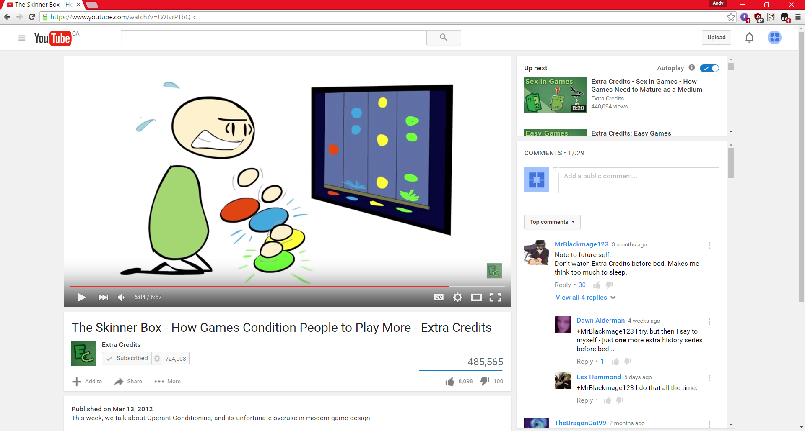

# Youtube Sidechat
A JQuery script to reorganize YouTube's video watching page. 

## How to Install
On Chromium-based browsers:
1. Install the Tampermonkey extension from the Chrome Web Store.
2. Go to https://github.com/AndyLTang/Youtube-Sidechat/raw/master/YTSidechat.user.js
3. You should see a page with Tampermonkey. Click the Install button in the page.

## Sample screenshots

## Patch Notes

#### v0.0.3 
 * Fixed script loading more than once because of iFrames
#### v0.0.2 
 * Fixed page overscrolling
#### v0.0.1 
 * Initial Release